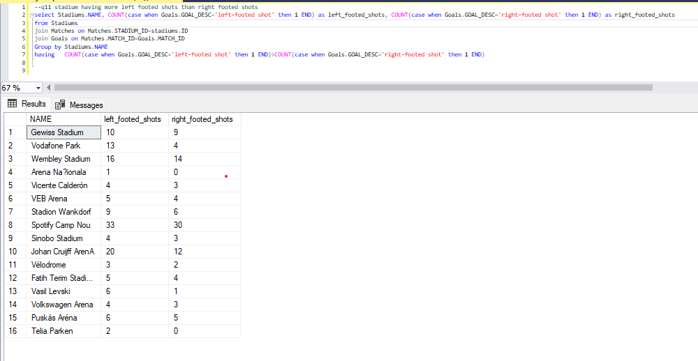

# UEFA Champions League
## Introduction
### UEFA Champions League (UCL) is one of the biggest football competitions conducted by the Union of European Football Association. Started in 1955, UCL is one of the most viewed and anticipated football tournaments in the world.
### This database reflects the data of players, clubs and stadiums which were a part of UEFA Champions League from 2016-2022.

`Software Used For Creating Schema:` **Lucidchart**

`Software used for database creation:` **Microsoft SQL Server Management Studio**

#
# ERD Model

# Tables Created
## Team Table:
The Team table contains information about the club, i.e its stadium etc. It has primary key team id and foreign key home stadium id.
## Player Table:
The Player table contains information about the player, such as player_id, player_name, player_position, player_jerseyno. etc. The player_id is the primary key of this table, and player_club_id is the foreign key referencing the team table.
## Match Table:
The Match table contains information about the match, such as match_id, match_date, match_time, match_stadium_id, home and away team ids etc. The match_id is the primary key of this table, and match_stadium_id is foreign key from Stadium Table, home and away team ids are foreign keys from the teams table.
## Goal Table:
The Goal table contains information about the goals scored in each match, such as goal_id, goal_description, and goal_match_id. The goal_id is the primary key of this table, and goal_match_id is the foreign key referencing the Match table, PID references the player that scored the goal and ASSIST refers to the player who assisted the goal.
## Stadium Table:
The stadium table has information about a stadium, its city. Stadium has primary key ID and foreign key city from the 33 Location table.
## Manager Table:
The manager table has information about the managers. It has managerID is the primary key and teamID is the foreign key that refers to the team that the manager is managing.
## Location Table:
The location table has city as the primary key and country as the foreign key. It can be used to determine the country of a stadium or any other entity.

# Normalization
We have analyzed each table's functional dependencies and classified them as full functional or partial functional dependencies except for the redundancy that occurred by using city and country names again and again in teams and stadiums. We tackled this by creating a location table with city as primary key and this allowed us to just refer to the country of a team by knowing its stadium.  Based on this analysis, we have identified that after our configuration of the schema, all tables are in the third normal form (3NF). Hence, we do not need to apply any further normalization to remove bad relations.

# Results
 Here are the results to the queries which we created and ran

## Query 1

#
## Query 2

#
## Query 3

#
## Query 4

#
## Query 5

#

## Query 6

#

## Query 7

#

## Query 8

#

## Query 9

#

## Query 10

#

## Query 11

#

## Query 12

#

## Query 13

#

## Query 14

#

## Query 15

#

## Query 16

# 

## Credits
This database was designed and implemented by @AhmadHassan71 (21I-0403) and @FarazRashid (21I- 0659). If you have any questions or feedback, please feel free to contact us at our emails.