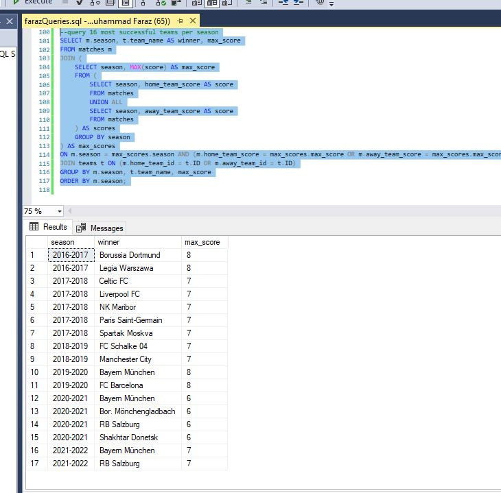

# UEFA Champions League
## Introduction
### UEFA Champions League (UCL) is one of the biggest football competitions conducted by the Union of European Football Association. Started in 1955, UCL is one of the most viewed and anticipated football tournaments in the world.
### This is database reflects the data of players, clubs and stadiums which were a part of UEFA Champions League from 2016-2022.

`Software Used For Creating Schema:` **Lucidchart**

`Software used for database creation:` **Microsoft SQL Server Management Studio**

#
# ERD Model

## Brief Explanation
#
- A team can have multiple managers in the tenure of 2016-2022

# Tables Created

# Challenges We Faced

# Results
 Here are the results to the queries which we created and ran

## Query 1

#
## Query 2

#
## Query 3

#
## Query 4

#
## Query 5

#

## Query 6

#

## Query 7

#

## Query 8

#

## Query 9

#

## Query 10

#

## Query 11

#

## Query 12

#

## Query 13

#

## Query 14

#

## Query 15

#

## Query 16

# 

## Credits
This database was designed and implemented by @AhmadHassan71 (21I-0403) and @FarazRashid (21I- 0659). If you have any questions or feedback, please feel free to contact us at our emails.